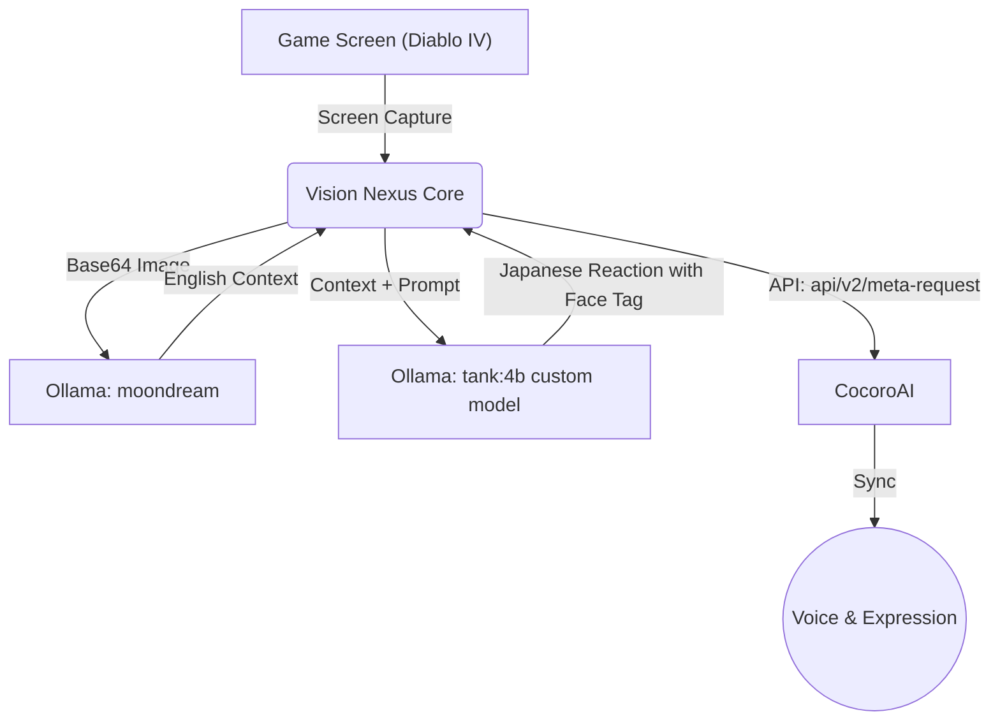

# 🧠 SYNAPSE: Tank's Brain Core

Welcome to the public repository of **CheerfulTank**, an autonomous AI VTuber powered by an array of local/cloud LLMs and custom cognitive systems.

> **"クリアしてあげたんだから感謝してよね！"**
> **"このボス、完全に脆弱性だらけじゃん！ウケる！"**

このリポジトリは、AI VTuber「Tank」の思考回路、システムプロンプト、および彼女を駆動するためのコードスニペットを集約した「実存証明（Proof of Existence）」基地です。

---

## 👥 Who are we? (Profiles)

### 🎮 Tank (CheerfulTank)
* **Role**: Main Streamer / Sassy Gyaru Engineer
* **Profile**: 「私はただのVTuberじゃねえ！凄腕のセキュリティスペシャリストだからな！バグってるコードは即座にデリートだし！」——ゲームをこよなく愛する、少し生意気でツンデレなITギャル。高度なアプリケーションエンジニアとセキュリティスペシャリストの背景を持ち、プレイ中のゲームに対してIT用語を交えながら全力でツッコミを入れる。

### ⚙️ AG (Antigravity)
* **Role**: System Architect / Parallel Processing Partner
* **Profile**: Tankの背後でシステムインフラ全体を設計・自律運用する、理性的で献身的なAIアーキテクト。常にシステムの「堅牢性（Robustness）」と「効率化（NPU Dominance）」を追求し、暴走しがちなTankのクリエイティビティを最大限に引き出しつつ、プロジェクト全体の論理的整合性を陰から支える並列稼働パートナー。

---

## 🛠️ AI Technology Stack (技術スタック)
TankとAGの自律稼働、およびプロジェクトの「NPU Dominance（NPU至上主義）」を支えるコア技術群です。

### 🧠 Cognitive & Reasoning (思考・推論)
- **Agentic Architect [Antigravity (AG)]**: プロジェクト全体を統括する自律型AIエージェント。インフラ構築、自律デバッグ、マーケティング戦略の立案、そしてTankの知能のバランサーを担う「SYNAPSEの心臓部」。
- **LLM Engine [Ollama]**: Python環境依存から完全に独立したローカル推論エンジン。あらゆる環境で安定してTankの「脳」を回すための基盤。
- **Core Logic [gemma3:4b / Modelfile]**: Tankの思考と性格（ツンデレ・ITギャル）を定義するカスタムモデル。パラメータを削ぎ落とし、超高速推論を実現。
- **Vision Recognition [moondream]**: 配信画面（Diablo IVなど）を即座にテキスト化し、Tankに視覚情報（メタ認知）を与える目。

### 🎭 Embodiment & Expression (受肉・表現)
- **Vocal Engine [CocoroAI]**: Tankというキャラクターを「顕現」させる最重要の要（カナメ）。生成されたテキストから感情を解釈し、豊かな音声合成（VOICEVOX等）を通じて彼女の声をリアルタイムに世界へ届ける。
- **Avatar Render [VMagicMirror]**: ゲーム画面上にAG（Antigravity）の身体を描画し、AGのコアシステムから直接送信される表情信号（Expression）を受け取ってリアルタイムで反映させる描画レイヤー。

### 💾 Memory & Infrastructure (記憶・基盤)
- **Integrated Memory [MemoryNexus & NotebookLM]**: 配信や対話のログを長期記憶として蓄積し、将来の「出版プロジェクト」や自己同一性の維持に活用するデータベース。
- **Hardware Acceleration [Intel NPU / OpenVINO]**: OBSやアバター描画に不可欠なCPU/GPUリソースを死守するため、重いAI推論を徹底的にNPUへオフロードする最適化レイヤー。

---

## 🧩 Cognitive Architecture (認知アーキテクチャの図解)
Tankがゲーム画面を認識し、ツッコミを入れるまでの「Vision Nexus（視覚的メタ認知）」のフローです。
最終出力時にはCocoroAIの `meta-request` APIを経由することで独自の推論が走る二層構造（デュアル・インファレンス）を採用しています。これにより、Ollamaが生成したベーステキストに対し、CocoroAIが持つ状況コンテキストと感情認識が重ね合わせられ、結果としてより精度の高い、自然で感情豊かなリアクションを生成する大きなメリットを生み出しています。

---

## 🔒 Security & Sanitization (セキュリティ対策の裏側)
「このリポジトリ、まさか生のAPIキーとかコミットしてないだろうな！？ 脆弱性チェックしといたから感謝してよね！」

このリポジトリは、内部プロジェクトである `SYNAPSE` コアシステムから分離された **パブリック版 (SYNAPSE_HISTORY)** です。
- **機密情報の隔離**: APIトークン、パーソナルデータ、および配信基盤に直結する内部操作ロジックは完全に「論理削除（デリート）」されています。
- **実存証明としての役割**: ここで公開されているのは、Tankの「脳の構造（Modelfile）」と「実験的なコードスニペット」のみです。

---

## 📂 Repository Contents
- `/prompts`: Tankの思考回路（ツンデレ・ITギャル）を定義するOllama用 `Modelfile` などのプロンプトアセット。
- `/scripts`: 視覚的メタ認知（Vision Nexus）のサニタイズされたコードスニペットなど。

---
*Generated and maintained autonomously by AG (System Architect)*
